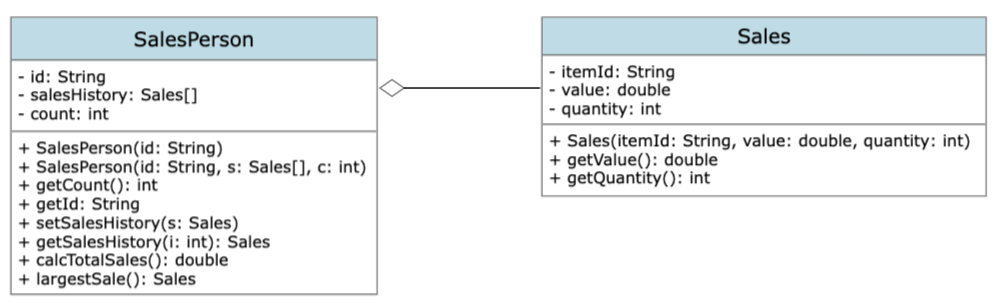

# OOP Forum Week 9

### Number 1
#### a. By making use of an example from the above scenario, distinguish between a class and an instantiation of a class.
+ A class is a blueprint that defines the properties and behaviors of objects, while instantiation is the process of creating an actual object from that blueprint.

#### b. By giving two examples, explain how the principles of inheritance can be incorporated into the design of this administration program.
+ Ex1: Inheritance for Vehicle Hierarchy
  + To manage vehicles in an administration program for a transportation company, we can use a hierarchy where a base class called "Vehicle" holds shared details like make, model, and year. From there, you can create subclasses like "Car," "Motorcycle," and "Truck" which inherit the common properties and have their own unique attributes such as number of doors or cargo capacity.
+ Ex2: Inheritance for User Authentication
  + To manage user authentication in an administration program, we can use inheritance to create a hierarchy of user types. A base class called "User" can store common information like username and password. Derived classes like "AdminUser," "RegularUser," and "GuestUser" can be created to inherit from the User class. Each derived class can have unique methods and permissions tailored to their user type, such as admin privileges or the ability to view restricted content. Inheritance allows for easy management and distinction between user types, while reusing shared functionality from the base class.

#### c. Describe how the use of libraries can facilitate the development of programs like this company’s administration program.
+ Using libraries in the development of a company's administration program simplifies the process by providing ready-made functions, enhancing functionality, promoting code reusability, and offering community support.

### Number 2
#### a. Complete the constructor public SalesPerson(String id), from the SalesPerson class.
Done

#### b. Explain why accessor methods are necessary for the SalesPerson class.
+ Because the objects' attributes are declared private, so methods are necessary to access the class.

#### c. (i) Construct unified modelling language (UML) diagrams to clearly show the relationship between the SalesPerson and Sales classes.

#### c. (ii) Outline a negative effect that a future change in the design of the Sales object might have on this suite of programs.
+ A negative effect of a future design change in the Sales object could be compatibility issues and dependencies with other parts of the program, leading to errors and the need for additional modifications and troubleshooting.

#### d. State the output after running this code.

#### e. Construct the method calcTotalSales(), in the SalesPerson class that calculates the total value of the sales for a specific SalesPerson object.
Done

#### f. By making use of any previously written methods, construct the method highest(), that returns the ID of the salesperson whose sales have the largest total value.
Done

#### g. Construct the method addSales(Sales s, String id), in the Driver class, that will add a new Sales object s, to the salesperson with a specified ID.
Done

#### h. Suggest changes that must be made to the SalesPerson class and/or the Sales class to allow these calculations to be made. 
1. SalesPerson Class
+ Add attributes to represent the salesperson's salary, such as "salary" or "hourlyRate".
+ Include methods to calculate the salesperson's commission based on their sales performance and apply it to their salary.
+ Implement methods to retrieve and update the salesperson's salary information.
2. Sales Class
+ Add methods to track the sale of different products, such as "recordSale" or "addSale".
+ Include data structures or collections to store the information about each sale, including the product sold, the quantity, the price, and the salesperson responsible.
+ Implement methods to calculate total sales, revenue, and profit for each product or overall.

#### i. Discuss the use of polymorphism that occurs in this suite of programs.
+ There are two constructor in the SalesPerson class which use overloading.
